# White Label Platform — ER Diagram

Multi-tenant white-label product platform. Every tenant-owned table carries an
indexed `tenant_id`. `products` is a **global catalog**; `tenant_products`
decides which tenant offers which product.

> Render: paste into any Mermaid viewer (GitHub, VS Code Mermaid preview,
> https://mermaid.live).

```mermaid
erDiagram
    %% ---------- Tenancy & Identity ----------
    tenants ||--o{ users : "employs"
    tenants ||--o{ customers : "owns"
    tenants ||--o{ tenant_products : "offers"
    tenants ||--o{ roles : "defines"
    tenants ||--o{ audit_logs : "scopes"
    tenants ||--o{ notifications : "scopes"

    users ||--|| user_profiles : "has"
    users ||--o{ sessions : "opens"
    users ||--o{ user_roles : "assigned"
    roles ||--o{ user_roles : "granted_to"
    users ||--o{ audit_logs : "acts"
    users ||--o{ notifications : "receives"

    %% ---------- Product Catalog (global) ----------
    product_categories ||--o{ products : "groups"
    products ||--|| product_details : "describes"
    products ||--o{ product_plans : "offers"
    products ||--o{ product_how_it_works : "explains"
    products ||--o{ product_beneficiary : "lists_benefits"
    products ||--o{ product_why : "justifies"
    products ||--o{ product_reviews : "reviewed_in"
    products ||--o{ product_faqs : "answers"

    product_plans ||--o{ product_costs : "priced_by"

    %% tenant_products: join tenants <-> products
    products ||--o{ tenant_products : "enabled_for"

    %% ---------- Commerce ----------
    customers ||--o{ customer_purchases : "buys"
    product_plans ||--o{ customer_purchases : "sold_as"
    customers ||--o{ product_reviews : "writes"

    customer_purchases ||--o{ invoices : "billed_by"
    invoices ||--o{ payments : "paid_by"

    %% ===================== ENTITIES =====================
    tenants {
        uuid id PK
        text name
        text slug "unique subdomain"
        timestamptz created_at
        timestamptz deleted_at "soft delete"
    }

    tenant_products {
        uuid id PK
        uuid tenant_id FK
        uuid product_id FK
        boolean enabled
        text label_override "white-label name"
        numeric price_override
    }

    users {
        uuid id PK
        uuid tenant_id FK
        text email "UNIQUE(tenant_id,email)"
        text password_hash
        timestamptz created_at
        timestamptz deleted_at
    }

    user_profiles {
        uuid id PK
        uuid user_id FK
        text full_name
        text phone
        text avatar_url
    }

    roles {
        uuid id PK
        uuid tenant_id FK "null = system role"
        text name "admin|agent|viewer"
    }

    user_roles {
        uuid user_id FK
        uuid role_id FK
    }

    sessions {
        uuid id PK
        uuid user_id FK
        text token "hashed"
        text ip_address
        text user_agent
        timestamptz expires_at
    }

    products {
        uuid id PK
        uuid category_id FK
        text name
        text status "draft|active|archived"
    }

    product_categories {
        uuid id PK
        text name
        text slug
    }

    product_details {
        uuid id PK
        uuid product_id FK
        text summary
        text body
    }

    product_plans {
        uuid id PK
        uuid product_id FK
        text name "tier name"
        text billing_period "monthly|yearly"
    }

    product_costs {
        uuid id PK
        uuid plan_id FK
        numeric amount
        text currency
    }

    product_how_it_works {
        uuid id PK
        uuid product_id FK
        int step_order
        text title
        text description
    }

    product_beneficiary {
        uuid id PK
        uuid product_id FK
        text benefit "feature / who it helps"
    }

    product_why {
        uuid id PK
        uuid product_id FK
        text reason
    }

    product_reviews {
        uuid id PK
        uuid product_id FK
        uuid customer_id FK
        int rating
        text body
    }

    product_faqs {
        uuid id PK
        uuid product_id FK
        text question
        text answer
    }

    customers {
        uuid id PK
        uuid tenant_id FK
        text email "UNIQUE(tenant_id,email)"
        text full_name
        timestamptz created_at
    }

    customer_purchases {
        uuid id PK
        uuid tenant_id FK
        uuid customer_id FK
        uuid plan_id FK
        text status "pending|active|cancelled"
        timestamptz purchased_at
    }

    invoices {
        uuid id PK
        uuid tenant_id FK
        uuid purchase_id FK
        text number
        numeric total
        text status "draft|sent|paid|void"
        timestamptz issued_at
    }

    payments {
        uuid id PK
        uuid tenant_id FK
        uuid invoice_id FK
        numeric amount
        text method
        text status "succeeded|failed|refunded"
        timestamptz paid_at
    }

    audit_logs {
        uuid id PK
        uuid tenant_id FK
        uuid user_id FK "nullable"
        text action
        text entity
        uuid entity_id
        jsonb changes
        timestamptz created_at
    }

    notifications {
        uuid id PK
        uuid tenant_id FK
        uuid user_id FK
        text type
        text message
        boolean read
        timestamptz created_at
    }
```

## Relationship summary
- A **tenant** has many users, customers, roles, and offered products.
- A **user** has one profile, many sessions, many roles (via `user_roles`).
- A **product** (global) belongs to a category and has details, plans, benefits,
  how-it-works steps, why entries, reviews, and FAQs.
- A **plan** has many cost rows; a **customer** buys a plan via `customer_purchases`.
- A **purchase** is billed by invoices; an **invoice** is settled by payments.
- **audit_logs** and **notifications** are scoped to a tenant (and a user).
